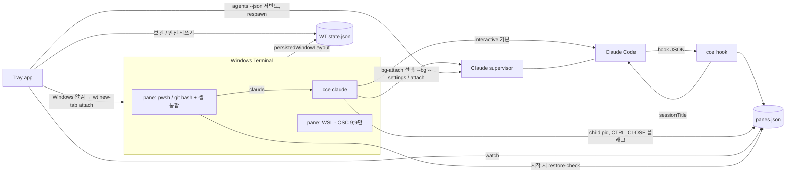

# RALPLAN: claude_env 1차 구현 계획 — 세션 보존·복원 + 탭 제목 + 트레이 설정 UI

- 상태: **consensus reached — pending execution approval**
- 모드: RALPLAN-DR SHORT (`--direct`)
- 개정: rev 5, 최종 (2026-09-23). rev 4를 Critic이 승인(APPROVE)했고, 승인 조건 1건과 선택 개선 5건을 반영했다. 변경 내역은 12절.
- 입력: `.omc/specs/deep-interview-claude-env.md` (AC-1 ~ AC-11, R1 ~ R6), `CLAUDE.md`, `docs/기획/초안.txt`
- 범위: 1차 = 세션 보존·복원, 탭 제목, 트레이 상주 설정 UI. 2차(계정 자동 전환)는 9절에 짧게만 적는다.
- 조사 환경: Windows 11 Home, Windows Terminal 1.24.11911.0, Claude Code 2.1.280 (로컬에서 읽기 전용으로 확인)

### 스펙 변경 사항 (사용자 결정, 이 계획이 따르는 기준)
- **AC-7 개정:** 탭 제목은 항상 `<Claude 상태 아이콘> <별칭> [<계정>] · <세션 부제>` 형식이다. 세션 부제는 세션별 별칭이며, 기본값은 Claude Code가 탭 제목에 보여 주는 작업 요약(자동 생성 제목)이다. 사용자가 바꿀 수 있다. (rev 4: 자동 생성 제목은 S4(d) 합격 시에만 얻을 수 있으므로, 그 전까지 잠정 기본값은 첫 프롬프트의 로컬 요약이다. Q8·4.6절) 예: `✳ claude_env [개인] · 로그인 버그 수정`. 같은 프로젝트의 탭은 부제로 구분하며 `·2` 같은 번호는 붙이지 않는다.
- **AC-2 완화(A 방식):** 응답 도중 창을 닫으면 **마지막 사용자 메시지와 완료된 턴은 보장한다.** 스트리밍 중이던 assistant 응답의 뒷부분은 잃을 수 있다. 복원된 탭은 "중단됨"으로 표시되고 이어서 진행할 수 있다.
- **WSL 범위:** 1차에서 WSL 탭은 일반 셸 탭(셸 종류와 폴더)으로만 복원한다. Claude 대화 복원은 Windows용 claude만 대상이다. WSL 안의 claude는 1차 범위 밖이며 2차 이후 다시 검토한다.
- **C 방식에서 창을 닫은 뒤:** Claude Code 기본 동작(supervisor가 약 1시간 유지, 즉시 정지 없음)을 따른다. 붙어 있지 않은 백그라운드 세션이 권한 요청, 선택지 질문, 그 밖의 사용자 입력을 기다리면 트레이가 Windows 알림을 보낸다. 알림을 누르면 가능하면 그 세션을 열어 붙인다.
- **C `bgIsolation`:** 프로젝트별 설정이며 기본값은 `none`(원래 폴더를 직접 편집)이다. 설정에서 프로젝트별로 `worktree`로 바꿀 수 있다. 실행할 때마다 넘기며 전역 설정은 고치지 않는다.

### 미리 밝혀 두는 조건
**S3(백그라운드 세션 스파이크)가 실패하면 제품은 A 방식만으로 나간다. 그 경우 AC-1의 엄격한 보장("응답을 끝낸 뒤 종료")은 이 설계로는 제공할 수 없다.** A에서 AC-1은 "중단 감지 + 이어가기"로만 충족한다.

---

## 0. 조사 결과 요약 (위험별 검증 상태)

| ID | 질문 | 상태 | 확인된 사실 | 출처 |
|----|------|------|-------------|------|
| R1a | WT `persistedWindowLayout`이 무엇을 복원하나 | **VERIFIED** | 창 위치·크기·이름, 창별 탭 배치, pane 분할과 pane별 profile을 저장한다. pane 내용은 저장하지 않는다(1.21부터 화면 버퍼 텍스트는 복원). 셸이 OSC 9;9로 폴더를 보고하면 그 폴더도 저장한다. | [WT Startup](https://learn.microsoft.com/en-us/windows/terminal/customize-settings/startup), [WT 1.21 Preview](https://devblogs.microsoft.com/commandline/windows-terminal-preview-1-21-release/), [same-directory](https://learn.microsoft.com/en-us/windows/terminal/tutorials/new-tab-same-directory) |
| R1b | 원래 명령을 다시 실행하나 | **PARTIALLY** | 버퍼 복원은 명령을 다시 실행하지 않는다. pane의 `commandline`이 저장·재실행되는지는 문서에 없다. → S1 | [How-To Geek: WT 1.21](https://www.howtogeek.com/windows-terminal-1-21-release/) |
| R1c | 저장 시점과 위치 | **VERIFIED(시점) / 로컬 확인(위치)** | 창을 열어 둔 동안 자동 저장, `quit`이면 전체 저장, **마지막 창을 X로 닫으면 그 창만 저장**. 위치는 `%LOCALAPPDATA%\Packages\Microsoft.WindowsTerminal_8wekyb3d8bbwe\LocalState\state.json`의 `persistedWindowLayouts`. 스키마는 문서화되어 있지 않다. `compatibility.allowHeadless`(Preview)가 켜져 있으면 창이 없어도 WT 프로세스가 남는다. | Startup 문서, 로컬 확인 |
| R1d | 외부에서 `wt.exe`로 배치를 열 수 있나 | **VERIFIED** | `new-tab`/`split-pane`(`-H`/`-V`, `-s`), `-p`, `-d`, `--title`, `--suppressApplicationTitle`, `focus-tab -t`, `-w <id|name|new|0>`, `;` 연결. 인자 배열을 `CreateProcess`로 직접 넘긴다. | [WT command line arguments](https://learn.microsoft.com/en-us/windows/terminal/command-line-arguments) |
| R2a | 창을 닫을 때 자식 프로세스가 받는 신호 | **VERIFIED(OS) / UNVERIFIED(WT+claude)** | `CTRL_CLOSE_EVENT` 뒤 `SPI_GETHUNGAPPTIMEOUT`(기본 5000ms)이 지나면 강제 종료된다. 닫기를 무한히 미룰 수 없다. `CTRL_C`/`CTRL_BREAK`에는 시간 제한이 없고 처리기가 TRUE를 돌려주면 무시할 수 있다. → S2 | [HandlerRoutine](https://learn.microsoft.com/en-us/windows/console/handlerroutine) |
| R2b | 닫기 확인 대화상자 | **PARTIALLY** | `confirmCloseAllTabs`는 탭이 2개 이상일 때만 뜨고 프로세스 상태는 보지 않는다. | [ninjaone](https://www.ninjaone.com/blog/configure-do-you-want-to-close-all-tabs-in-windows-terminal/) |
| R2c | 백그라운드 세션(C) | **VERIFIED(문서) / UNVERIFIED(Windows 실사용)** | supervisor가 세션을 돌리고 탭은 `claude attach <id>`로 붙는다. 붙어 있을 때 `/exit`, `←`, `Ctrl+Z`, 빈 프롬프트에서 `Ctrl+C` 두 번, `Ctrl+D` 두 번은 모두 **detach일 뿐**이다. 세션 안에서 끝내려면 `/stop`. 붙은 세션은 fullscreen 렌더링만 된다. 기본으로 worktree 격리를 하며 `worktree.bgIsolation: "none"`으로 끈다. `--settings <file-or-json>`으로 실행 단위 설정을 넘긴다. | [Agent view](https://code.claude.com/docs/en/agent-view), [CLI reference](https://code.claude.com/docs/en/cli-reference) |
| R2d | 백그라운드 세션 수명 | **VERIFIED(문서)** | 끝났거나 다음 메시지를 기다리는 세션이 약 1시간 동안 붙은 클라이언트 없이 있으면 supervisor가 프로세스를 멈춘다. 대화는 남고 attach나 답장으로 다시 시작된다. 작업 중이거나 권한 요청 등 대화상자에서 멈춘 세션, 고정한 세션(`Ctrl+T`)은 멈추지 않는다. `claude respawn <id>`는 실행 중이거나 멈춘 세션을 다시 시작한다. | Agent view 문서 |
| R3a | 대화 기록 위치 | **VERIFIED** | `~/.claude/projects/<인코딩한 cwd>/<session-id>.jsonl`. `CLAUDE_CONFIG_DIR`로 바꿀 수 있다. | [Sessions](https://code.claude.com/docs/en/sessions), [.claude directory](https://code.claude.com/docs/en/claude-directory) |
| R3b | 이어가기 명령 | **VERIFIED** | `claude --resume <id|name|.jsonl 절대경로>`(어느 폴더에서나 v2.1.223+), `--continue`, `--session-id <uuid>`, `--fork-session`, `--name/-n`. 대화형 `--resume`은 `--fork-session`이 없으면 같은 ID를 이어 쓴다. `--resume --bg`와 respawn에서 ID가 유지되는지는 확인되지 않았다. → S3 | 같은 문서 |
| R3c | 기록 시점과 마지막 메시지 누락 | **UNVERIFIED** | 메시지 단위로 덧붙여 쓰는 것으로 보인다. 스트리밍 중이던 assistant 메시지는 강제 종료 시 잃을 수 있다(AC-2 완화로 수용). 사용자 메시지와 완료된 턴이 남는지는 S2에서 확인한다. | — |
| R3d | 훅 | **VERIFIED** | 공통 입력은 `session_id`, `transcript_path`, `cwd`, `hook_event_name`. `SessionStart`는 `source`(`startup|resume|clear|compact|fork`)와 현재 제목 `session_title`을 받는다. **`SessionStart`(`startup|resume|fork`)와 `UserPromptSubmit`의 출력 `sessionTitle`은 `/rename`과 같은 효과로 세션 제목을 정한다.** `SessionEnd` 예산은 1.5초. `Stop`은 `last_assistant_message`를 받는다. 명령 훅의 기본 셸은 bash(Git Bash)이고, Git Bash가 없으면 PowerShell. `args`를 주면 셸을 거치지 않는 exec 형식이다. `SessionStart`의 `initialUserMessage`는 `-p` 모드에서만 적용된다. | [Hooks reference](https://code.claude.com/docs/en/hooks) |
| R3e | 세션 상태를 외부에서 읽기 | **VERIFIED, 한계 있음** | `claude agents --json [--all]` 필드: `kind`, `id`, `state`(`working|blocked|done|failed|stopped`), `pid`, `status`(`busy|waiting|idle`), `waitingFor`, `sessionId`, `name`, `cwd`, `startedAt`. **붙은 클라이언트 여부 필드는 없다.** 레지스트리에 기록한 attach 자식 pid와 시작 시각으로 판단한다. | Agent view 문서 |
| R4a | Claude Code의 탭 제목 | **VERIFIED** | OSC로 제목을 계속 갱신한다. 이름이 없으면 첫 프롬프트를 요약한 자동 생성 제목을 쓰고, `--name`/`/rename`/훅 `sessionTitle`로 이름을 주면 그 이름을 쓴다(`terminalTitleFromRename` 기본 true). 이름이 없는 세션의 자동 생성 제목은 statusline 입력의 `session_name`에도 나타난다. 같은 이름을 쓰는 살아 있는 세션이 있으면 변형 이름을 붙인다. | [settings reference](https://code.claude.com/docs/en/settings-reference), [Sessions](https://code.claude.com/docs/en/sessions), [Statusline](https://code.claude.com/docs/en/statusline) |
| R4b | 제목 끄기와 `terminalSequence` | **VERIFIED(문서) / 이슈 있음** | `CLAUDE_CODE_DISABLE_TERMINAL_TITLE=1`은 Windows에서 무시된다는 이슈가 있다(#16572, #47397). 훅 `terminalSequence`(OSC 0/1/2/9/99/777, BEL)는 대화형 세션이고 화면이 표시되어 있을 때만 내보낸다. | [env-vars](https://code.claude.com/docs/en/env-vars), [Hooks](https://code.claude.com/docs/en/hooks), [#16572](https://github.com/anthropics/claude-code/issues/16572), [#47397](https://github.com/anthropics/claude-code/issues/47397) |
| R4c | 이름을 줘도 아이콘이 남는가, 자동 생성 제목을 얻을 수 있는가 | **UNVERIFIED** | → S4 | — |
| R4d | WT `suppressApplicationTitle` | **VERIFIED** | 아이콘도 사라지므로 마지막 대안으로만 쓴다. | WT command line 문서 |
| R5 | (2차) 사용량 % | **VERIFIED** | statusline `rate_limits.five_hour/seven_day.used_percentage`(Pro/Max, 첫 응답 이후). | [Statusline](https://code.claude.com/docs/en/statusline) |
| R6 | (2차) 자격증명과 계정 분리 | **VERIFIED(위치) / PARTIALLY(교체)** | `%USERPROFILE%\.claude\.credentials.json`, `CLAUDE_CONFIG_DIR`로 분리, `claude auth status` JSON. | [Authentication](https://code.claude.com/docs/en/authentication) |
| R7 | PowerShell 실행 정책 | **VERIFIED** | Windows 클라이언트 기본값 `Restricted`에서는 프로필이 실행되지 않는다. | [about_Execution_Policies](https://learn.microsoft.com/en-us/powershell/module/microsoft.powershell.core/about/about_execution_policies) |

---

## 1. 요구사항 요약 (스펙 AC 대응)

| 스펙 AC | A(기본)에서의 대응 | C(프로젝트별 선택)에서의 대응 |
|---------|--------------------|--------------------|
| AC-1 | **대체 충족(승인됨):** `cce`가 `CTRL_CLOSE_EVENT`를 받으면 pane을 `interrupted`(마지막 상태가 busy 또는 권한·입력 대기일 때. `idle_prompt` 뒤의 idle은 제외)로 기록한다. 복원하면 제목에 중단 표시를 붙이고 같은 대화를 연다. `autoContinueOnInterrupted`(기본 off)를 켜면 이어가기 프롬프트를 자동으로 보낸다. | **엄격 충족:** supervisor가 턴을 끝낸다. |
| AC-2 | **완화 기준(승인됨):** 마지막 사용자 메시지와 완료된 턴은 모두 남는다. 스트리밍 중이던 응답 뒷부분은 잃을 수 있다. | 전부 남는다. |
| AC-3 | WT `persistedWindowLayout` + 트레이 레이아웃 보관기 | 동일 |
| AC-4 | 레지스트리 → `restore-check` → `claude --resume <id>`(Windows용 claude만) | `claude attach <id>`. 멈춘 세션이면 `claude respawn <id>` 후 attach |
| AC-5 | WT profile 복원 + OSC 9;9(pwsh·Git Bash·WSL) | 동일 |
| AC-6 | E2E V-6 | V-6C |
| AC-7(개정) | 훅이 `sessionTitle`로 `<별칭> [<계정>] · <부제>`를 정하고, Claude Code가 아이콘과 함께 그린다(4.6절) | attach 상태에서의 전달은 S4(b) |
| AC-8 | `projects.json` + 설정 UI | 동일 |
| AC-9 | 아이콘은 Claude Code가 그린다. 계정은 `cce claude`가 실행 시 **한 번만** `claude auth status`를 호출해 표시 이름으로 바꿔 `panes.json`에 캐시하고, 훅은 캐시만 읽는다(4.1절). 훅은 `claude auth status`나 네트워크를 호출하지 않는다 | 동일 |
| AC-10 | Tauri 2 트레이 앱(복원 on/off, 별칭, 계정 표시 이름, 프로젝트별 실행 방식·격리, 세션 부제) | 동일 |
| AC-11 | 로그인 시 자동 시작, 셸 통합과 훅이 자동 처리 | 동일 |

---

## 2. RALPLAN-DR 요약

### 원칙
1. **WT와 Claude Code의 공식 기능을 먼저 쓴다.** 도구는 둘을 잇는 레지스트리와 자동화만 만든다.
2. **문서화된 계약에만 기댄다.** 예외는 두 가지이며 ADR에 기록한다: (1) WT `state.json` 읽기와 되쓰기, (2) 복원 후에도 `WT_SESSION`이 유지된다는 가정(S1(c)로 판정하고, 틀리면 2순위 매칭으로 대체).
3. **사용자 설정은 필요한 부분만 고치고 되돌릴 수 있게 한다.** 도구가 표시한 항목만 넣고 빼며, 원래 값을 기록했다가 되돌린다.
4. **먼저 확인하고 나중에 만든다.**
5. **가볍게.** 훅 p95 100ms 이하. 네트워크 호출 없음.

### 핵심 결정 요인 (상위 3)
1. AC-1 충족 수준과 스펙 Non-Goal(백그라운드 실행 방식 불채택)의 균형
2. AC-3 "WT만 열면 자동 복원"
3. 유지 비용과 평소 사용감(scrollback 등)

### 선택지

| | A. WT 기본 복원 + 훅 레지스트리 + 대화형 claude | B. 도구가 배치를 소유하고 `wt.exe`로 재구성 | C. A + Claude pane은 백그라운드 세션 attach |
|---|---|---|---|
| 장점 | 구현이 가장 작고 사용감이 그대로다 | 복원 순서를 완전히 제어 | AC-1 엄격 충족 |
| 단점 | AC-1은 대체 충족. 여러 창을 차례로 닫는 경우는 보관기로 보완 | 실행 중인 WT 레이아웃을 읽을 공식 API가 없다. WT가 먼저 기본 창을 띄운 뒤 도구가 창을 다시 여는 구조라 **창이 두 번 열리고 깜빡인다** | fullscreen 전용, Windows 안정성 미확인, 붙음 여부를 직접 추적해야 함 |

**선택(사용자 결정): A 기본, C는 프로젝트별 선택(opt-in).** 전역 `defaultRuntime`(초기값 `"interactive"`)과 `projects.json`의 `runtime`이 있고 프로젝트 값이 우선한다. C가 이정표 M-C(Step 6)를 통과하면 기본을 C로 바꾸고 A를 선택 사항으로 둔다.

**B를 버린 이유:** (1) 실행 중인 WT의 창·탭·분할 구조를 읽을 공식 API가 없다. UI Automation으로는 탭 제목만 보이고 분할 구조는 안 보인다. (2) 사용자가 WT를 직접 열면 WT가 먼저 기본 창을 띄우고 도구가 뒤이어 창을 다시 열어야 하므로 창이 두 번 열리고 깜빡인다. **다만 4.4절의 두 예외 경우(트레이가 꺼져 있던 동안 창이 빠진 경우, S1(f) 실패로 `state.json` 되쓰기가 안 되는 경우)에는 `wt.exe` 재구성을 받아들인다.** 이때는 되쓰기라는 더 나은 수단이 없고, 사용자가 알림을 눌러 명시적으로 요청했을 때만 실행하므로 깜빡임이 예고된 동작이 된다.

**D(자체 PTY 중계 호스트)를 버린 이유:** Claude Code supervisor + attach와 기능이 겹치고, VT 중계(리사이즈, 입력 인코딩, OSC 처리)를 직접 구현해야 한다. C를 opt-in으로 허용했으므로 Non-Goal은 버린 이유가 아니다.

---

## 3. 기술 스택

| 구성 | 선택 | 이유 |
|------|------|------|
| 핵심 로직 + CLI(`cce.exe`) | **Rust** (serde, clap, notify, windows-rs) | 훅 콜드 스타트 수 ms, `SetConsoleCtrlHandler`로 직접 신호 처리, 트레이와 crate 공유 |
| 트레이 앱 + 설정 UI | **Tauri 2** (`tray-icon`, notification 플러그인) + Svelte | WebView2 기본 설치로 가볍다. [Tauri system tray](https://v2.tauri.app/learn/system-tray/) |
| 자동 시작 | `tauri-plugin-autostart` | 공식 플러그인 |
| 셸 통합 | `shell/cce.ps1`(PS 5.1/7), `shell/cce.bash`(Git Bash), `shell/cce-wsl.sh`(WSL, OSC 9;9만) | |

버린 스택: Electron(무거움), .NET WinUI 3(CLI를 따로 AOT 빌드해야 하고 패키징이 복잡), Python(콜드 스타트, 배포).

---

## 4. 아키텍처

### 4.1 `cce.exe`

#### `cce claude [args]` — 실행기
1. **환경 확인:** `WT_SESSION`이 없으면(VS Code 터미널 등) 아무것도 기록하지 않고 인자를 그대로 넘겨 실제 `claude`를 실행한다.
2. **인자 분류 규칙**(첫 번째로 해당하는 규칙을 적용):

| 순서 | 조건 | 동작 |
|---|---|---|
| 0 | **`cce` 자체 옵션**: `--attach-session <id>`(트레이 알림·메뉴가 씀. 지정한 세션에 attach) 등. 분류 전에 **먼저 소비**하며 `claude`에는 절대 전달하지 않는다 | 소비 후 나머지 인자로 1~5를 적용. `--attach-session`은 규칙 5의 "복원" 경로(bg-attach: `claude attach <id>`)로 간다 |
| 1 | 첫 인자가 하위 명령: `auth`, `mcp`, `agents`, `attach`, `logs`, `stop`, `respawn`, `rm`, `config`, `update`, `doctor`, `install`, `setup-token`, `plugin`, `project`, `migrate-installer` 등. 목록은 `claude --help`에서 추출한 표를 코드에 둔다 | **그대로 전달**, 기록 없음 |
| 2 | 비대화형·정보 플래그: `-p`, `--print`, `-v`, `--version`, `-h`, `--help`, `--output-format`, `--input-format` | **그대로 전달**, 기록 없음 |
| 3 | 사용자가 `--resume`/`-r`/`--continue`/`-c`/`--session-id`/`--fork-session`을 줌 | 사용자 값을 쓰고 `cce`는 세션 ID를 넣지 않는다. 세션 ID는 `SessionStart` 훅에서 받는다 |
| 4 | 사용자가 `--name`/`-n`을 줌 | 사용자 이름을 **세션 이름으로 그대로 둔다**(도구가 감싸지 않음). 이유: `claude -r foo`처럼 이름으로 이어가는 사용이 계속 동작해야 한다. 레지스트리에 `titleManaged: false`만 기록한다(`subtitle`·`subtitleSource`는 건드리지 않는다. 사용자 이름은 4.6절 부제 결정 순서에 들어가지 않으며, 설정 창에는 세션 이름 그대로 표시만 한다). **사용자가 그 이름을 지울 때까지 도구는 그 탭의 제목을 관리하지 않는다**(`sessionTitle`을 내지 않음, 4.6절). 잠정 사용자 기본값이며 나중에 설정에서 바꿀 수 있게 둔다. `--name`은 그대로 전달 |
| 5 | 그 밖(프롬프트 인자, `--model`, `--permission-mode` 등). **`-`로 시작하지 않는 모르는 첫 인자는 프롬프트로 본다**(전달이 아니라 주입 쪽) | 사용자 인자는 그대로 두고, `cce`가 필요한 인자만 덧붙인다: 새 대화 → `--session-id <cce가 만든 UUID>`, 복원 → `--resume <id>` |

3. **실행 방식 분기**(프로젝트 `runtime` → `defaultRuntime`, 규칙 3~5에 해당할 때만):
   - interactive: `claude [사용자 인자] [--session-id <uuid> | --resume <id>]`
   - bg-attach: `claude --bg [사용자 인자] --session-id <uuid> --settings <임시 파일 경로>` 뒤에 `claude attach <id>`를 자식으로 실행. `--settings`는 **인라인 JSON이 아니라 임시 파일 경로**로 넘긴다(Windows `CreateProcess` 인용 문제 회피). 파일 내용은 `{"worktree":{"bgIsolation":"<프로젝트 값, 기본 none>"}}`, 위치는 `%APPDATA%\claude_env\tmp\settings-<uuid>.json`, 자식 종료 후 삭제한다. `--session-id`와 `--bg`를 함께 쓸 수 없으면(S3-2) 실행 직전 시각 이후 `startedAt`과 cwd로 `claude agents --json`에서 찾는다.
4. **계정 캐시(규칙 3~5에 해당할 때만):** 자식을 실행하기 전에 `claude auth status`(JSON)를 **한 번만** 호출해 이메일을 `config.json`의 `accounts`로 표시 이름에 연결하고, 결과를 pane 기록의 `account`에 쓴다. 실패하거나 로그아웃 상태이면 `account`를 비우고 제목에는 `[?]`를 쓴다. 훅은 이 캐시만 읽는다(원칙 5). 이 호출의 실행 지연은 S5(c)에서 측정한다.
5. 자식 프로세스에 `CCE_PANE_KEY`(= `WT_SESSION`)를 넘기고, 자식 pid와 프로세스 시작 시각을 레지스트리에 기록한다.
6. **신호와 종료 구분(경쟁 조건 처리):**
   - `cce`는 시작할 때 `SetConsoleCtrlHandler`를 등록한다. `CTRL_C_EVENT`/`CTRL_BREAK_EVENT`는 TRUE를 돌려 **무시한다**(자식 claude는 자기 처리기로 받는다). 따라서 `cce`는 이 두 신호로 죽지 않는다.
   - `CTRL_CLOSE_EVENT`를 받으면 처리기가 **맨 먼저 원자적 플래그 `closing=1`을 세우고**, 그다음 레지스트리에 닫힌 시각과 상태를 쓴다(목표 1초 이내): `lastStatus`가 `busy` 또는 `waiting`(권한 요청·선택지·입력 대기)이면 **state=`interrupted`와 플래그 `interrupted=true`를 함께** 쓰고, 그 밖(`idle` 포함. `idle_prompt` 뒤는 `idle`이다)이면 `windowClosed`. 플래그 `interrupted`는 이후 상태 전이(`claimed` → `active`)에서 건드리지 않고 **첫 `UserPromptSubmit`에서만** 지운다(4.6절, 4.7절).
   - 자식이 끝나면 메인 스레드는 **300ms를 기다린 뒤 `closing` 플래그를 확인한다.** 플래그가 서 있으면 아무것도 쓰지 않는다(처리기가 이미 썼거나 쓰는 중). 플래그가 없을 때만 `closed`(interactive) 또는 `detached`(bg-attach)를 쓴다.
   - 레지스트리 쓰기에서도 우선순위를 강제한다: **`windowClosed`/`interrupted` > `closed`/`detached`.** 더 높은 상태를 낮은 상태로 덮어쓰는 쓰기는 거부된다(같은 pane에서 새 실행으로 `active`가 될 때만 초기화).
   - 두 기록이 모두 없는데 자식 pid가 사라졌으면 트레이가 발견해 `windowClosed`로 처리한다.

#### `cce hook <event>` — 훅 진입점
- `CCE_PANE_KEY`가 없고 레지스트리에 해당 `session_id`도 없으면 **아무 일도 하지 않고** 빈 출력으로 exit 0(VS Code 터미널 등).
- 상태 전이: `UserPromptSubmit` → busy(플래그 `interrupted`가 서 있으면 지움), `Stop` → idle, `Notification(permission_prompt|elicitation_dialog|agent_needs_input)` → waiting(+ C 세션이면 트레이 알림 트리거 기록), **`Notification(idle_prompt)` → idle**(턴이 끝난 뒤 60초 유휴 알림이므로 대기가 아니다. 이 뒤에 창을 닫으면 `windowClosed`이지 `interrupted`가 아니다), `SessionStart` → `sessionLineage`에 `session_id` 추가, `SessionEnd`는 기록만.
- 제목 출력(`sessionTitle`)은 4.6절 규칙을 따른다. 계정 표시는 pane 기록의 `account` 캐시에서만 읽는다. **훅은 `claude auth status`, `claude agents`, 네트워크를 호출하지 않는다**(원칙 5).
- **무해한 경쟁:** bg-attach에서 S3-2 대체 경로(`agents --json`으로 세션 ID 탐색)를 쓰면 `SessionStart` 훅이 탐색보다 먼저 실행될 수 있다. 이때 훅은 pane 기록에서 `session_id`를 연결하지 못하므로 `sessionTitle`을 내지 않고 exit 0 하며, 다음 `UserPromptSubmit`에서 제목을 정한다. 제목만 늦어지고 상태 기록은 어긋나지 않는다.
- 언제나 exit 0이며 Claude를 막지 않는다.

#### `cce restore-check --shell <pwsh|bash>`
- PowerShell과 Git Bash에서만 호출한다(WSL에는 없음). `WT_SESSION`이 없으면 바로 끝낸다. 동작은 4.3절.

#### `cce install` / `uninstall` / `doctor` — 4.5절

### 4.2 트레이 앱
- **세션 감시기:** 레지스트리 파일 변경 감시(`notify`)를 주로 쓰고, `claude agents --json --all`은 **붙어 있지 않은 C 세션이 하나라도 있으면 WT 실행 여부와 관계없이 15초**, 그 밖에는 WT가 실행 중일 때 15초, 아닐 때 60초 간격으로 조회한다. 붙음 여부는 레지스트리의 attach 자식 pid + 시작 시각으로 판단한다. 폴링 경로는 알림의 **보장 경로**이고, `Notification` 훅 → 레지스트리 → 알림의 훅 경로는 S3-9가 합격한 경우에만 더 빠른 경로로 추가한다.
- **C 세션 정책(사용자 결정):** 창을 닫은 뒤에는 Claude Code 기본 동작(약 1시간 유지 후 supervisor 자동 정지)에 맡기고 **즉시 정지하지 않는다.** 붙어 있지 않은 세션이 `blocked`이거나(`waitingFor`: 권한 요청, 입력 필요, 대화상자) `Notification` 훅이 waiting을 기록하면 **Windows 알림**을 보낸다: "<별칭> · <부제>: 권한 요청을 기다립니다". 같은 세션에 대한 알림은 상태가 바뀔 때까지 한 번만 보낸다.
- **알림에서 세션으로 가는 경로(대체 순서, T-12):**
  1. 알림 클릭 → `wt -w 0 new-tab -d <cwd> cce claude --attach-session <id>`로 새 탭에서 붙는다(S3-8 합격 시).
  2. Windows에서 알림 클릭 활성화가 안 되면(Tauri 2 notification 플러그인의 한계. S3-8은 정확히 이 점을 시험한다) 알림은 그대로 띄우고, 트레이 메뉴 항목 **"입력 대기 세션 N개"** 아래 세션별 항목을 누르면 같은 명령으로 붙는다. 이 메뉴 항목은 S3-8 결과와 관계없이 항상 둔다.
  3. attach가 불가능하면(세션이 사라졌거나 `respawn` 실패) 새 탭에서 agent view(`claude agents`)를 연다.
- **레이아웃 보관기:** 4.4절.
- **복원 on/off:** `restoreEnabled`를 끄면 WT `firstWindowPreference`를 manifest에 기록된 원래 값으로 되돌리고 `restore-check`도 멈춘다. 다시 켜면 `persistedWindowLayout`으로 설정한다.
- **설정 창:** Step 5.

### 4.3 복원 흐름과 pane 찾기 (PowerShell·Git Bash pane만)
1. WT가 창·탭·분할·profile·폴더를 복원한다. WSL pane은 여기서 끝난다(셸과 폴더만 복원).
2. `cce restore-check`가 레지스트리를 잠그고 이 pane의 `windowClosed`/`interrupted` 기록을 찾는다.
   - **1순위:** 기록의 `wtSession` = 현재 `WT_SESSION`(S1(c)).
   - **2순위:** WT 시작 후 30초 안에만 쓴다. 보관 스냅샷과 현재 `state.json` 자동 저장본을 비교해 **탭 순서(창별 탭 수와 탭마다의 pane profile 순서)가 정확히 같을 때만** (창 번호, 탭 번호, pane 순서) + cwd로 맞춘다. 가져갈 수 있는 pane 수는 **스냅샷에 있던 Claude pane 수를 넘지 않는다.** 어긋나면 자동 복원하지 않고 알림으로 "복원할 Claude 세션 N개"를 보여 준다.
3. 찾으면 `claimed`로 표시하고 실행한다.
   - interactive: `claude --resume <현재 id>`. 중단 표시는 4.6절. `autoContinueOnInterrupted`가 켜져 있으면 이어가기 프롬프트를 위치 인자로 붙인다(`claude --resume <id> "<이어가기 문구>"`).
   - bg-attach: 살아 있으면 `claude attach <id>`, `stopped`이면 `claude respawn <id>` 뒤 attach. 새 ID가 생기면 `sessionLineage`에 추가한다.

### 4.4 레이아웃 보관기 (원칙 2 예외 (1))
- **"WT 완전 종료":** `WindowsTerminal.exe` 프로세스가 모두 사라진 상태. `allowHeadless`가 켜져 있어 프로세스가 남으면 되쓰지 않고 알림만 한다.
- **보관:** WT가 실행 중일 때 `state.json` 변경을 감시해 `layouts/`에 보관하고, 창 수가 줄어드는 순간을 기록한다.
- **합치기:** 마지막 창이 닫히기 전 `closeGraceSeconds`(기본 60초) 안에 닫힌 창들을 합친다.
- **되쓰기 안전장치:** (1) S1(a)에서 확인한 키 구조와 다르면 쓰지 않고 `doctor` 경고와 알림을 띄운다. (2) 임시 파일에 쓴 뒤 원자적으로 교체한다. (3) 교체 직전에 WT 프로세스가 없는지 다시 확인한다. (4) 원본을 `layouts/state.<ts>.bak`로 보관한다.
- **트레이가 꺼져 있던 경우:** WT 기본 동작(마지막 창만 복원)으로 돌아간다. 트레이가 켜지면 최근 스냅샷과 비교해 "이전 창 N개 복원" 알림을 띄우고, 누르면 `wt.exe`로 재구성한다(B 방식의 예외적 사용).
- **S1(f) 실패 시:** 되쓰기 대신, 트레이가 WT 첫 창 실행을 감지하면 빠진 창을 `wt -w <name> new-tab/split-pane`으로 재구성한다.

### 4.5 설치·제거·진단
- **표시 항목만 넣고 빼기:** `~/.claude/settings.json`에는 `cce.exe` 절대경로를 쓰는 `hooks` 항목만 넣고 뺀다(`args` exec 형식). WT `settings.json`(JSONC, 주석 보존)의 `firstWindowPreference`는 원래 값을 `install-manifest.json`에 기록한 뒤 바꾸고, 제거할 때 되돌린다. 셸 프로필은 `# >>> claude_env >>>` 블록만 넣고 뺀다. 전체 백업은 수동 복구용으로만 둔다.
- **훅 실행 셸:** Git Bash, 없으면 PowerShell. 두 경우 모두 exec 형식과 절대경로(공백·한글 포함)로 같게 동작해야 한다(S5).
- **셸 통합:**
  - PowerShell 5.1과 7의 `$PROFILE` 모두: OSC 9;9, `claude` 함수, `restore-check`.
  - Git Bash: 로그인 셸이 읽는 `.bash_profile`이 `.bashrc`를 부르는지 확인하고, 필요하면 연결한다. OSC 9;9, `claude` 함수, `restore-check`.
  - **WSL:** `wsl -l -q`로 배포판마다 `~/.bashrc`에 **OSC 9;9 폴더 보고만** 넣는다(`wslpath -w "$PWD"`). `claude` 함수와 `restore-check`는 넣지 않는다.
- **실행 정책:** `Restricted`/`AllSigned`이면 이유를 설명하고 동의를 받은 뒤에만 CurrentUser 범위를 `RemoteSigned`로 바꾼다. 원래 값을 기록하고 제거할 때 되돌린다. 거부하면 PowerShell 자동 재개가 꺼지고 `doctor`가 노랑으로 표시한다.
- **프롬프트 프레임워크:** oh-my-posh·starship이 있으면 prompt를 감싸서 원래 prompt를 부른 뒤 OSC 9;9를 내보내고, 이미 pwd OSC를 내보내면 중복하지 않는다. `doctor`가 실제 출력을 확인한다.

### 4.6 탭 제목 (개정 AC-7)
- **형식:** `<Claude 상태 아이콘> <별칭> [<계정>] · <부제>`. 아이콘은 Claude Code가 그린다. 도구는 세션 이름만 정한다.
- **정하는 수단:** 훅 출력 `sessionTitle`(`/rename`과 같은 효과). `SessionStart(startup|resume|fork)`와 `UserPromptSubmit`에서 낼 수 있다. `--name`은 주입하지 않는다. 계정 표시는 pane 기록의 `account` 캐시에서 읽는다(4.1절 4).
- **사용자가 이름을 준 탭(잠정 사용자 기본값):** `cce claude --name foo` 또는 세션 안 `/rename foo`처럼 사용자가 직접 이름을 주면 그 이름을 **그대로 세션 이름으로 둔다**(도구가 `<별칭> [<계정>] · foo`로 감싸지 않음). 이유: `claude -r foo`처럼 이름으로 이어가는 사용이 계속 동작해야 한다. 이때 pane 기록에 `titleManaged: false`를 쓰고, 사용자가 그 이름을 지울 때까지(`/rename`으로 비우거나 설정 창의 세션 항목에서 "도구가 제목 관리"를 다시 켤 때까지) 도구는 `sessionTitle`을 내지 않는다. 나중에 설정에서 "감싸기"로 바꿀 수 있게 둔다. `/rename` 감지 방법은 S4(e).
- **피드백 루프 방지(S4(e)):** 감지한 이름이 도구 자신의 형식(T-7 정규식과 일치하고, 부제가 레지스트리의 `subtitle`과 같음)이면 사용자 `/rename`으로 **보지 않는다**. 도구가 정한 이름을 `session_title`로 되돌려 받는 경우가 여기에 해당한다.
- **부제 결정 순서:**
  1. 사용자 지정값: 설정 창의 세션 부제(`subtitleSource: user`). (`--name`·`/rename`은 위 규칙대로 감싸지 않으므로 여기에 들어오지 않는다)
  2. Claude 자동 생성 제목(`subtitleSource: auto`): **S4(d)가 합격한 경우에만** 쓴다. 합격 조건은 "세션 이름을 `SessionStart` 또는 첫 `UserPromptSubmit`에서 정한 뒤에도 자동 제목이 생성되고 얻을 수 있다"이다. 자동 제목을 `claude agents --json`의 `name`으로만 얻을 수 있으면 훅은 그것을 호출할 수 없으므로(원칙 5) **트레이 폴링이 레지스트리 `subtitle`에 써 넣고 훅은 읽기만 한다.** 훅 입력(statusline `session_name`, transcript)으로 얻을 수 있으면 훅이 직접 쓴다.
  3. 대체값(`subtitleSource: prompt`): `cce`가 첫 프롬프트를 로컬에서 줄인 요약(앞 24자, 줄바꿈과 공백 정리). 네트워크 호출은 없다.
- **시점(Q8 잠정 결정 = 선택지 2, S4(d) 합격 시 재검토):**
  - 새 대화, `SessionStart(startup)`: 처음부터 `<별칭> [<계정>]`을 정한다. Claude 기본 제목은 보이지 않는다. 같은 프로젝트 탭을 프롬프트 없이 둘 이상 열면 둘 다 `<별칭> [<계정>]`이고 Claude가 변형 접미어를 붙일 수 있다(R4a). **이 접미어는 첫 프롬프트 전에 한해 허용한다**(T-7). 도구는 자리 표시 부제를 붙이지 않는다(부제 없는 상태를 그대로 보여 주는 편이 정확하다).
  - 첫 `UserPromptSubmit`: 두 가지를 한다. (a) 레지스트리에 `subtitle`이 **없을 때만** 출처 3 요약을 계산해 저장하고 `<별칭> [<계정>] · <출처 3 요약>`으로 정한다. 이미 있으면(복원 뒤 첫 프롬프트, 설정 창에서 미리 정한 값) 그 값을 그대로 쓰고 덮어쓰지 않는다. (b) 플래그 `interrupted`가 서 있으면 지운다.
  - 그다음 `UserPromptSubmit`(S4(d) 합격 시에만): 자동 제목(출처 2)이 확보되어 있으면 부제를 출처 2로 **한 번** 교체한다. 이 교체는 T-7의 실패가 아니다(T-7에 명시).
  - 복원(`SessionStart(resume)`): 레지스트리에 저장된 부제로 바로 전체 형식을 정한다.
- **중단 표시:** 레지스트리 pane 기록의 `interrupted` 플래그에 둔다(state `interrupted`와 별개. state는 `claimed` → `active`로 바뀌어도 플래그는 남는다). 복원 시 `SessionStart(resume)`의 `sessionTitle`을 `<별칭> [<계정>] · ⏸중단 <부제>`로 정하고, 세션 안에 안내 메시지도 띄운다. **`titleManaged: false`인 탭(`--name`/`/rename`)은 세션 안 안내 메시지만 띄우고 제목에는 절대 표시하지 않는다**(사용자 이름을 건드리지 않음). **첫 `UserPromptSubmit`에서 플래그를 지우고 `sessionTitle`을 원래 형식으로 되돌린다.** 사용자가 프롬프트 없이 닫으면 표시가 남지만, 이는 "중단된 뒤 아직 이어가지 않음"이라는 사실과 같고 다음 복원 때 다시 계산된다.
- **중복 이름:** 같은 프로젝트의 탭은 부제로 구분한다. 부제까지 같으면 Claude Code가 변형 접미어를 붙이며 이를 받아들인다. `claude --resume` 목록에도 이 이름들이 보이고, 같은 별칭 접두어를 가진 항목이 여러 개 생긴다(이름으로 이어갈 때 여러 개가 맞으면 선택기가 열린다는 점을 README에 적는다).
- **T-7과 T-1A는 이 규칙 하나만 쓴다.**

### 4.7 데이터 파일 (`%APPDATA%\claude_env\`)
- `config.json`: `{ "schema": 3, "restoreEnabled": true, "defaultRuntime": "interactive", "autoContinueOnInterrupted": false, "closeGraceSeconds": 60, "accounts": [{ "email": "a@b.com", "displayName": "개인" }] }`
- `projects.json`: `{ "<정규화 경로>": { "alias": "claude_env", "runtime": "interactive|bg-attach", "bgIsolation": "none|worktree" } }`(`bgIsolation` 기본 `none`)
- `panes.json`: pane key별 `wtSession`, `shell`, `cwd`, `runtime`, `sessionLineage[]`, `childPid`, `childStart`, `account`(실행 시 `claude auth status`로 한 번 채운 표시 이름 캐시. 훅은 읽기만), `state`(`active|closed|detached|windowClosed|interrupted|claimed`), `interrupted`(플래그. `CTRL_CLOSE` 처리기가 state와 함께 `true`로 세우고, 이후 state 전이는 건드리지 않으며, 첫 `UserPromptSubmit`에서만 `false`), `titleManaged`(사용자가 `--name`/`/rename`을 준 탭은 `false`), `lastStatus`, `subtitle`, `subtitleSource`(`user|auto|prompt`), `notifiedState`, `closedAt`, `updatedAt`
- `install-manifest.json`, `layouts/`, `logs/`
- **스키마 동결 시점:** `panes.json` 스키마는 C 분기 구현(Step 4의 C 부분)과 S3 결과가 반영될 때까지 동결하지 않는다. 그 전까지 `schema` 번호를 올리며 이전 파일은 읽을 때 변환한다.

### 4.8 상호작용 그림

---

## 5. 구현 단계

### Step 0 — 실현 가능성 스파이크
생성 파일: `spikes/S1-wt-layout.ps1` ~ `spikes/S5-hook-env.ps1`, `docs/spikes/results.md`

**순서:** A 경로 판정용 **S1 → S5 → S4(a,c,d,e) → S2**를 순서대로 하고, **S3과 S4(b)는 Step 1과 병렬로 일찍 시작한다**(Critic 제안 반영). S3 결과가 레지스트리 스키마(`sessionLineage`, attach pid)에 영향을 주므로, 스키마는 S3 결과가 반영될 때까지 동결하지 않는다(4.7절).

| 스파이크 | 확인할 내용 | 합격 기준 | 불합격 시 대체 |
|---|---|---|---|
| **S1 WT 레이아웃** | (a) `persistedWindowLayouts` 키 구조 (b) commandline 재실행 여부 (c) 복원 후 `WT_SESSION` 유지 여부 (d) 폴더 복원 (e) 창 2개를 10초 간격으로 닫을 때 저장 내용과 자동 저장 간격 (f) WT가 꺼진 상태에서 되쓴 파일을 WT가 읽는가 | (d): pwsh 5.1·pwsh 7·Git Bash·WSL(Ubuntu) pane 각각에서 복원 후 `pwd` 출력이 닫기 전과 문자열로 같다(4/4). (e): 두 번째 창만 저장됨을 재현하고 간격을 초 단위로 기록. (a)(b)(c)(f)는 결과를 기록해 설계 분기에 쓴다 | (d) 실패한 셸 → 통합 수정 후 재시험. (c) 다름 → 2순위 매칭. (f) 실패 → `wt.exe` 재구성 |
| **S5 훅 환경** | (a) interactive 훅에 `CCE_PANE_KEY`·`WT_SESSION`이 보이는가 (b) 훅 셸(Git Bash/PowerShell)과 exec 형식 절대경로(공백·한글) (c) 훅 시간, 그리고 **`cce claude`가 실행 시 한 번 호출하는 `claude auth status`의 지연**(콜드·웜 각 10회, ms) (d) `Restricted` 재현과 `RemoteSigned` 이후 동작 (e) VS Code 터미널에서 `cce hook`이 아무 일도 하지 않는지 | (a) 보임, (b) 두 셸 동작, (c) 훅 p95 100ms 이하. 실행 지연은 측정값을 보고한다(p95가 1초를 넘으면 실행 간 캐시(짧은 TTL)를 rev 5에서 검토), (d) 재현·해결, (e) 레지스트리 변경 0 | (a) 실패 → `session_id`로 레지스트리 역조회 |
| **S4 제목 (interactive)** | (a) `sessionTitle`로 정한 이름이 WT 탭에 `<아이콘> <이름>`으로 보이는가, busy·idle·waiting의 아이콘 글리프와 코드포인트 수, idle에서 아이콘 유무 (c) 부제까지 같은 이름이 둘일 때 변형 접미어 (d) **Claude 자동 생성 제목을 얻을 수 있는가**: 이름이 없는 세션에서 statusline `session_name`, transcript의 제목 레코드, `claude agents --json`의 `name` 가운데 어디에 나타나는가. 하위 확인 두 가지: (d-1) `SessionStart`에서 이름을 정하면 자동 제목이 여전히 생성·획득되는가, (d-2) **이름을 `SessionStart`가 아니라 첫 `UserPromptSubmit`에서 정할 때** 자동 제목이 여전히 생성되고 얻을 수 있는가(statusline `session_name`, transcript, 그 밖) (e) 사용자가 `/rename`한 값을 감지할 수 있는가(다음 `SessionStart`의 `session_title`, statusline `session_name`, transcript). **도구 자신의 형식(T-7 정규식 일치 + 부제가 레지스트리 `subtitle`과 같음)은 `/rename`으로 세지 않는다** (f) `UserPromptSubmit`의 `sessionTitle`이 첫 프롬프트에서 바로 탭에 반영되는가 | (a) 세 상태 모두에서 아이콘을 뺀 텍스트가 정한 이름과 같다. (d)는 d-1 또는 d-2 가운데 하나라도 자동 제목을 얻을 수 있으면 합격이며, 합격 시에만 4.6절 출처 2를 켠다(Q8 재검토). (e)는 결과로 감지 수단을 확정한다. (c)의 변형 접미어 형식은 T-7의 첫 프롬프트 전 정규식에 넣는다 | (a) 실패 → 훅 `terminalSequence`로 제목 출력(Claude와 같은 글리프 사용) → 그것도 안 되면 `--suppressApplicationTitle`(아이콘 포기, 사용자 승인). (d) 실패 → 부제 대체값(첫 프롬프트 요약). 기존 statusline(OMC HUD 등)을 쓰는 경우 statusline 방식은 쓰지 않는다 |
| **S2 닫기 신호 (A의 AC-1·AC-2)** | 응답 중 탭 닫기·창 닫기 → (a) 처리기가 1초 안에 레지스트리를 쓰는가 (b) jsonl에 마지막 사용자 메시지와 완료된 턴이 모두 있는가, 스트리밍 중 응답이 어떻게 남는가 (c) `SessionEnd` 발생 여부 (d) **권한 요청에서 멈춘 턴(`lastStatus=waiting`)을 닫았을 때**: 기대 상태는 state `interrupted` + 플래그 `interrupted=true`(턴이 끝나지 않았으므로). jsonl에 사용자 메시지가 남고, 복원 시 제목에 ⏸중단 표시가 붙는가. 10회. **반례(d-2):** 턴이 끝나고 `Notification(idle_prompt)`가 온 뒤 창을 닫으면 `windowClosed`이지 `interrupted`가 아니어야 한다(복원 시 ⏸중단 없음). 10회 (e) **경쟁 반복 시험:** 자식 claude 정상 종료 직후에 창을 닫는 경우와 창 닫기만 하는 경우를 각각 20회 | (a) 20/20 (b) 20/20 (d) 10/10 `interrupted`이고 복원 후 ⏸중단 표시 10/10, 반례 d-2는 10/10 `windowClosed`이고 ⏸중단 0/10 (e) 40회 중 오분류 0 | (a) 실패 → 트레이가 pid 소멸로 판단 |
| **S3 bg-attach (C, 일찍 병렬 진행)** | S3-1 `claude --bg`(프롬프트 없이) → attach / S3-2 `--session-id` + `--bg` / S3-3 `--settings`의 `bgIsolation: none`이 전역 설정 변경 없이 적용되어 원래 폴더를 편집하는가, `worktree`로 바꾸면 `.claude/worktrees/` 아래를 편집하는가 / S3-4 attach 자식 pid 추적, X 닫기와 `/exit`·`←` detach 구분, **경쟁 반복 시험 20회** / S3-5 응답 중 창 닫기 → 턴·파일 수정 완료, jsonl 완전(10회) / S3-6 `blocked` 턴에서 창을 닫은 뒤 대기 유지 / S3-7 respawn과 `--resume --bg`의 ID 유지 / S3-8 **Tauri 2 notification 플러그인의 Windows 알림 클릭 활성화**가 앱에 전달되는가, 전달되면 `wt -w 0 new-tab ... cce claude --attach-session <id>`로 붙는가(정확히 이 두 단계를 나눠 기록) / S3-9 **붙어 있지 않은 bg 세션에서 `Notification` 훅이 발생하는가**, 그리고 `cce hook`이 그 pane을 찾을 수 있는가(`CCE_PANE_KEY`가 supervisor를 거쳐 상속되지 않을 수 있으므로 `session_id` 역조회 포함) | S3-1, S3-3, S3-4(오분류 0), S3-5(10/10), S3-6 합격. S3-2, S3-7, S3-8, S3-9는 결과를 기록해 대체 경로를 고른다(S3-9 합격 시 훅 경로를 알림의 빠른 경로로 추가, 불합격이면 폴링 15초만) | **C를 제공하지 않고 A만 출시한다. 이 경우 AC-1 엄격 보장은 제공하지 않는다.** S3-8 실패 시 4.2절 대체 순서 2·3(트레이 메뉴 "입력 대기 세션 N개" → attach, 불가하면 agent view) |
| **S4(b) 제목 (attach)** | attach 상태에서 `sessionTitle`로 정한 이름과 아이콘이 WT 탭에 보이는가 | 아이콘을 뺀 텍스트가 4.6절 형식과 같다 | `cce`가 attach 직전에 OSC 0을 직접 출력. 덮어써지면 C 프로젝트에 한해 `--title` 고정(아이콘 포기, 설정 창에 표시) |

**완료 확인:** `docs/spikes/results.md`에 항목별 합격/불합격, 증거(스크린샷, JSON 발췌, 측정값), 선택한 대체 경로가 있다. S1·S5·S4·S2가 끝나야 Step 2의 A 부분을 완료로 볼 수 있다. S3·S4(b)는 Step 4의 C 부분 전에 끝낸다.

### Step 1 — 저장소 뼈대와 core crate
생성 파일: `Cargo.toml`, `crates/cce-core/src/{lib.rs,config.rs,projects.rs,registry.rs,title.rs,argclass.rs,wt_state.rs,paths.rs,manifest.rs}`, `crates/cce-core/tests/*.rs`, `.gitignore`(`.omc/`, `target/`, `node_modules/`)
- 스키마 모델(schema 3, 동결 전), 원자적 쓰기와 파일 잠금, 상태 우선순위 강제(`windowClosed`/`interrupted` > `closed`/`detached`).
- `title`: 4.6절 형식, 부제 결정 순서, 중단 표시 넣기와 지우기, 첫 프롬프트 요약(24자).
- `argclass`: 4.1절 인자 분류.
- 경로 정규화(대소문자, 끝 `\`, `/mnt/c/...`·Git Bash `/c/...` ↔ `C:\...`).
- `wt_state`: 모르는 구조이면 `Unknown`.
**완료 확인:** `cargo test -p cce-core` 통과. 포함 항목:
- 스키마 왕복, 별칭 기본값, 경로 정규화 8가지 사례
- 두 프로세스 동시 쓰기 1000회에서 손상 0건, 우선순위 역전 쓰기가 거부됨
- `state.json` 실제 샘플 파싱, 변형 샘플은 `Unknown`
- 제목 형식 표 10가지 사례(부제 없음·자동·사용자 지정·중단 표시·지우기·긴 프롬프트 요약 등)
- **인자 분류 표 14가지 이상:** `claude auth status` → 전달 / `claude -p "x"` → 전달 / `claude --version` → 전달 / `claude mcp list` → 전달 / `claude agents --json` → 전달 / `claude attach abc` → 전달 / `claude` → ID 주입 / `claude "버그 고쳐"` → 프롬프트 유지 + ID 주입 / **`claude foo`(하위 명령 표에 없는 단어)** → 프롬프트로 취급 + ID 주입 / `claude -r` → 주입 없음 / `claude --resume <id>` → 주입 없음 / `claude -c` → 주입 없음 / `claude --session-id <u>` → 사용자 값 / `claude -n foo` → `titleManaged: false` 기록 + 그대로 전달 / `claude --model opus` → 유지 + ID 주입 / **`claude --attach-session <id>`** → `--attach-session` 소비(claude에 전달되지 않음) + `claude attach <id>` 실행 + pane 기록 / **`claude --attach-session <id> --model opus`** → 소비 뒤 나머지 인자로 분류

### Step 2 — `cce.exe` (실행기, 신호 처리, 훅)
생성 파일: `crates/cce-cli/src/{main.rs,cmd_claude.rs,ctrl_handler.rs,cmd_hook.rs,cmd_restore.rs}`, `shell/cce.ps1`, `shell/cce.bash`, `shell/cce-wsl.sh`
- 4.1절 전부(interactive 먼저, bg-attach 분기는 S3 합격 후 켬), 4.6절 제목 출력.
**완료 확인:**
1. 훅 JSON 샘플 16종 통합 테스트에서 상태 전이와 `sessionTitle` 출력이 기대값과 같다.
2. `hyperfine` p95 100ms 이하.
3. 실제 콘솔 창을 닫는 자동화 테스트에서, 자식 정상 종료 → `closed`, 창 닫기 → `windowClosed`, 자식 종료 직후 창 닫기 → `windowClosed`가 각 20회 모두 맞는다(오분류 0).
4. `cce`에 `CTRL_C`/`CTRL_BREAK`를 보내도 `cce`가 살아 있다.
5. `WT_SESSION`이 없는 터미널에서 `cce claude`와 `cce hook`이 레지스트리를 바꾸지 않는다.
6. `claude` 함수가 PS 5.1·PS 7·Git Bash에서 `cce claude`로 연결되고, WSL에는 연결되지 않는다.

### Step 3 — 설치·제거·진단
생성 파일: `crates/cce-cli/src/{cmd_install.rs,cmd_uninstall.rs,cmd_doctor.rs}`, `crates/cce-core/src/jsonc_edit.rs`
**완료 확인:**
1. `cce install` 두 번째 실행에서 파일 변경 0건.
2. 설치 → 다른 도구가 훅을 추가하는 상황 흉내 → `cce uninstall` 뒤 그 훅은 남고 `cce` 항목만 없어진다. `firstWindowPreference`와 실행 정책이 manifest의 원래 값으로 돌아간다.
3. WT settings의 주석이 남는다.
4. oh-my-posh가 설정된 PS 7에서 OSC 9;9가 한 번만 나온다.
5. `Restricted` 정책에서 동의를 거부하면 정책이 바뀌지 않고 doctor가 노랑으로 표시한다.
6. WSL 배포판마다 OSC 9;9 블록만 들어가고 `claude` 함수는 없다.

### Step 4 — 복원 엔진 (A 먼저, C 분기는 S3 뒤)
생성 파일: `crates/cce-core/src/{restore.rs,layout_archive.rs,session_watch.rs,notify_policy.rs}`
**완료 확인:** 매칭 단위 테스트 12가지(정확 일치 / WT_SESSION 불일치 + 탭 순서 일치 / 탭 순서 불일치 → 복원 안 함 / 스냅샷 Claude pane 수 초과 claim 안 함 / cwd만 같은 새 탭 제외 / 30초 이후 제외 / 중복 claim 방지 / `detached`·`closed` 제외 / 중단 표시 / 멈춘 bg 세션 → respawn / lineage 갱신 / 모르는 state.json → 쓰기 없음). 보관기: 교체 직전 WT를 띄우면 쓰기를 포기한다. 알림 정책: 같은 blocked 상태에서 알림 1회, 상태가 바뀌면 다시 가능. 수동 V-3, V-4, V-6 통과.

### Step 5 — 트레이 앱과 설정 UI
생성 파일: `app/src-tauri/{Cargo.toml,tauri.conf.json,src/main.rs,src/tray.rs,src/commands.rs,src/notify.rs}`, `app/ui/{index.html,src/App.svelte,src/pages/{General,Projects,Sessions,Accounts,Diagnostics}.svelte,src/styles.css}`
- 일반: 복원 on/off(WT `firstWindowPreference` 연동), 기본 실행 방식, 중단 시 자동 이어가기, 창 합치기 유예.
- 프로젝트: 별칭, 실행 방식, C일 때 `bgIsolation`(기본 `none`, `worktree` 선택)과 "fullscreen 렌더링, scrollback 없음" 안내.
- 세션: 현재·최근 세션의 부제 보기와 수정(수정하면 다음 `UserPromptSubmit`이나 복원 때 반영). `titleManaged: false`인 탭(`--name`/`/rename`)은 "사용자 이름 유지"로 표시하고, "도구가 제목 관리"를 다시 켤 수 있다(4.6절).
- 트레이 메뉴: 설정 열기, 복원 on/off, **"입력 대기 세션 N개"**(붙어 있지 않은 C 세션 가운데 입력을 기다리는 것. 세션별 항목을 누르면 `cce claude --attach-session <id>`로 새 탭에서 붙는다. 4.2절 대체 순서 2), 종료.
- 계정: 이메일 ↔ 표시 이름. 진단: doctor 결과.
**완료 확인:**
1. 로그인 후 트레이만 뜨고 창은 뜨지 않는다.
2. 별칭을 바꾸면 1초 안에 `projects.json`에 반영되고, 이후 프롬프트에서 탭 제목이 바뀐다.
3. 복원을 끄면 WT `firstWindowPreference`가 원래 값으로 돌아가고 다음 실행에서 자동 재개가 없다. 다시 켜면 `persistedWindowLayout`이 된다.
4. 프로젝트 runtime을 `bg-attach`로 바꾸면 그 프로젝트의 다음 `claude`만 C로 실행된다.
5. 세션 부제를 바꾸면 다음 프롬프트 이후 탭 제목의 부제가 바뀐다.
6. 유휴 Working Set 80MB 이하.

### Step 6 — E2E 검증·문서·배포, 이정표 M-C
생성 파일: `docs/test-reports/<date>-e2e.md`, `docs/test-reports/<date>-mc-soak.md`, `README.md`, `CLAUDE.md`, `scripts/build.ps1`, `scripts/e2e/*.ps1`
- V-1A ~ V-11 실행, NSIS 설치 파일.
- **M-C 조건(모두 충족해야 기본값을 C로 바꿈):**
  1. S3 전 항목과 S4(b) 합격
  2. C 프로젝트 1개 이상으로 연속 14일 이상 실사용, 창 닫기 20회 이상
  3. 그 기간 동안 T-1C 실패 0, 복원 실패(잘못된 세션 연결 또는 유실) 0, supervisor 오류 0(트레이 로그)
  4. 사용자가 설정 창에서 fullscreen 렌더링과 격리 설정에 명시적으로 동의
  5. 그 시점의 Claude Code 버전으로 S3 재시험 합격
  - 충족하면 `defaultRuntime` 초기값을 `"bg-attach"`로 바꾸는 릴리스를 내고, 기존 사용자에게 한 번 안내한 뒤 동의하면 전환한다.
**완료 확인:** 6절 기준이 모두 통과로 기록되어 있다. `rg -n "TODO|todo!|unimplemented!|#\[ignore\]"` 결과가 0줄. M-C는 `-mc-soak.md`에 조건 1~5의 증거가 있을 때만 완료로 본다(1차 출시 조건은 아님).

---

## 6. 인수 기준

| # | 스펙 | 기준 | 확인 방법 |
|---|------|------|-----------|
| T-1A | AC-1, AC-2 (A) | 대화형 Claude 탭(cwd `C:\cce-e2e\a`)에서 "1부터 200까지 한 줄에 하나씩 쓴 `out.txt`를 만들어 줘"를 보내고, 스트리밍 중 창을 X로 닫는다. (1) 닫은 직후 레지스트리 상태가 `interrupted`이다. (2) jsonl에 방금 보낸 사용자 메시지와 이전의 완료된 턴이 모두 있다. (3) WT를 다시 열면 그 pane이 `sessionLineage` 마지막 ID로 열리고, 탭 제목이 4.6절의 중단 표시 형식이다. (4) 첫 프롬프트 뒤 중단 표시가 사라진다. (5) `autoContinueOnInterrupted`를 켜고 반복하면 **복원 후 120초 안에** `C:\cce-e2e\a\out.txt`가 200줄이다 | V-1A |
| T-1C | AC-1 (C) | `bgIsolation: none`인 C 프로젝트(cwd `C:\cce-e2e\c`)에서 같은 요청을 보내고 창을 닫는다. 60초 안에 **`C:\cce-e2e\c\out.txt`**가 200줄이고, jsonl의 마지막 assistant 메시지가 온전하며, `claude agents --json --all`의 `state`가 `done`이다. (`worktree`로 설정하면 확인 경로는 `C:\cce-e2e\c\.claude\worktrees\<세션 worktree>\out.txt`) | V-1C |
| T-2 | AC-2 | A·C 각각 3턴 대화 뒤 idle에서 창을 닫는다. 다시 열면 3턴이 모두 보이고 jsonl에 마지막 사용자·assistant 메시지가 있다. 응답 도중에 닫는 경우는 T-1A (2) 기준을 따른다 | V-2 |
| T-3 | AC-3 | 복원 켜짐 상태에서 시작 메뉴로 WT를 열면 10초 안에 창 수·탭 순서·분할 수가 보관 스냅샷과 같다 | V-3 |
| T-4 | AC-4 | 복원된 각 Windows Claude pane에서 `/status`의 Session ID가 `sessionLineage`의 마지막 값과 같고, 이전 대화가 이어지며, cwd가 같다 | V-4 |
| T-5 | AC-5 | pwsh 5.1·pwsh 7·Git Bash·WSL pane이 같은 profile로 열리고 `pwd`가 닫기 전과 같다. WSL pane에서는 Claude가 자동 실행되지 않는다 | V-5 |
| T-6 | AC-6 | 창 2개(창1: Claude 2 + pwsh 1 + 세로 분할 1, 창2: Claude 1 + Git Bash 1)를 10초 간격으로 닫고 WT를 열면 구조·폴더·세션이 모두 같다. A만 쓴 경우와 C 프로젝트를 하나 섞은 경우 두 번 | V-6, V-6C |
| T-7 | AC-7(개정) | 분기별로 확정된 정규식을 쓴다. `<ICON>`은 S4(a)에서 관측한 글리프 집합(여러 코드포인트 가능)이고, idle에서 아이콘이 없으면 선택 그룹이 비는 것을 허용한다. **(1) 첫 프롬프트 전:** `^(?:<ICON>\s)?<별칭> \[<계정 표시 이름>\](?:<변형 접미어>)?$`. `<변형 접미어>`는 S4(c)에서 관측한 형식이며 **첫 프롬프트 전에 한해 허용**한다(같은 프로젝트 탭 2개를 프롬프트 없이 열면 둘 다 이 형식). **(2) 첫 프롬프트 이후:** `^(?:<ICON>\s)?<별칭> \[<계정 표시 이름>\] · (?:⏸중단 )?.+$`. 부제는 출처 3(첫 프롬프트 요약)이며, S4(d)가 합격한 경우 그다음 `UserPromptSubmit`에서 출처 2(Claude 자동 제목)로 한 번 바뀔 수 있다. **이 한 번의 교체는 T-7 실패가 아니다.** 교체 뒤 부제는 세션이 끝날 때까지 바뀌지 않는다(사용자가 설정 창에서 바꾸는 경우 제외). 같은 프로젝트 탭 2개는 첫 프롬프트 뒤 부제가 서로 다르다. `titleManaged: false`인 탭(`--name`/`/rename`)은 이 기준의 대상이 아니다 | V-7, UI Automation 제목 수집 |
| T-8 | AC-8 | 등록 안 한 `D:\work\foo`의 별칭이 `foo`이고, `bar`로 바꾸면 이후 제목이 `bar`를 쓴다. 세션 부제를 바꾸면 다음 프롬프트 이후 반영된다 | V-8 |
| T-9 | AC-9 | **부제가 확정된 뒤**(첫 프롬프트 뒤. S4(d) 합격 시엔 출처 2로 교체된 뒤) 시작하는 **한 턴 전체** 동안만 측정한다: busy → waiting → idle을 0.5초 간격으로 수집한 제목에서 아이콘을 뺀 문자열이 전 구간 같다. 계정 표시가 실행 시 캐시된 `account`(= `claude auth status` 이메일에 연결된 표시 이름)와 같다 | V-9 |
| T-10 | AC-10 | 트레이·설정 창에서 복원 on/off(WT 설정 연동 포함), 별칭, 계정 표시 이름, 실행 방식, `bgIsolation`, 세션 부제를 편집할 수 있고 재시작 후에도 유지된다 | V-10 |
| T-11 | AC-11 | 스크립트 시나리오(WT 열기 → claude → 닫기 → 열기 ×3)에서 설정 창을 한 번도 열지 않고 T-3 ~ T-9가 성립한다 | V-11 |
| T-12 | C 알림 | 붙어 있지 않은 C 세션이 권한 요청에 걸리면 **20초 안에**(폴링 15초 + `agents --json` + 알림. S3-9 합격 시 훅 경로로 더 빨라질 수 있으나 기준은 20초) Windows 알림이 1회 뜬다. 세션으로 가는 경로는 4.2절 대체 순서를 따르며 각각 합격 기준이 있다: **(1)** S3-8 합격 시 알림 클릭 → 5초 안에 새 탭이 열리고 그 탭의 `/status` 세션 ID가 알림 대상과 같다. **(2)** 알림 클릭 활성화가 안 되는 경우(S3-8 불합격) 알림은 그래도 20초 안에 1회 뜨고, 트레이 메뉴 "입력 대기 세션 N개"의 N이 실제 수와 같으며, 세션 항목을 누르면 5초 안에 (1)과 같은 결과가 된다. **(3)** attach가 불가능한 경우(세션이 사라졌거나 respawn 실패) 5초 안에 새 탭에 agent view가 열리고 그 세션(또는 종료 기록)이 목록에 보인다 | V-12 |

---

## 7. 위험과 대응

| 위험 | 상태 | 대응 / 대체 경로 |
|------|------|-------------------|
| R1b pane 명령 재실행 | PARTIALLY | 재실행에 기대지 않고 `restore-check` |
| R1c 여러 창을 차례로 닫으면 마지막 창만 저장 | VERIFIED | 보관기 합치기와 안전 되쓰기, 실패하면 `wt.exe` 재구성 |
| R1c' `state.json` 스키마 변경 | 설계 위험 | 모르는 구조이면 쓰지 않음, 경고, 원본 백업 |
| R1d `WT_SESSION` 비유지 | UNVERIFIED | 제한된 2순위 매칭, 불확실하면 알림으로 수동 선택 |
| R2a 닫기 지연 불가 | VERIFIED | A: 중단 감지 + 이어가기(승인됨). C: 엄격 충족 |
| R2a' CTRL_CLOSE와 자식 종료의 경쟁 | 설계 위험 | 원자적 플래그 → 300ms 대기 후 확인 → 상태 우선순위 강제, S2·S3-4 반복 시험 |
| 인자 전달 오류(하위 명령에 ID 주입 등) | 설계 위험 | 인자 분류 규칙과 테스트 표. `cce` 자체 옵션은 분류 전에 소비하고 전달하지 않는다. `-`로 시작하지 않는 모르는 첫 인자는 **프롬프트로 본다**(주입). 하위 명령 표는 Claude Code 버전을 올릴 때 `claude --help`로 갱신하고 `doctor`가 차이를 경고한다 |
| 계정 표시 캐시 오래됨(실행 뒤 로그아웃·계정 전환) | 설계 위험 | 1차는 실행 시 한 번 캐시(`claude auth status`)로 충분하다고 본다. 훅에서 재조회하지 않는다(원칙 5). 2차 계정 전환에서 갱신 경로를 다시 정한다 |
| R2c C의 사용감·안정성 | UNVERIFIED | opt-in, `bgIsolation` 기본 `none`을 실행 단위로 전달, M-C 전 기본 전환 금지. S3 실패 시 A만 출시 |
| R2e C에서 `/exit` 등이 detach일 뿐 | VERIFIED | 자식 정상 종료 = detach로 처리 |
| R2f C 세션이 닫힌 뒤 최대 약 1시간 남음 | VERIFIED(문서) | 사용자 결정으로 수용. 입력을 기다리면 Windows 알림 |
| R3b' `--resume --bg`/respawn의 새 ID | UNVERIFIED | `sessionLineage` 추적 |
| R3c 스트리밍 응답 뒷부분 유실 | UNVERIFIED | AC-2 완화(승인됨), S2로 사용자 메시지·완료 턴 보존 확인 |
| R3e 붙음 여부 필드 없음 | VERIFIED | 레지스트리 pid + 시작 시각 |
| R4c 아이콘 유지, 자동 생성 제목 획득 | UNVERIFIED | S4. 실패하면 `terminalSequence`, 부제 대체값(첫 프롬프트 요약) |
| R4e 이름 중복 → 변형 접미어, `--resume` 목록에 비슷한 이름이 여러 개 | VERIFIED | 부제로 구분. 부제까지 같을 때만 접미어 허용, README에 안내 |
| 중단 표시가 세션 이름에 남음 | 설계 위험 | 첫 프롬프트에서 지움. 남아 있으면 "아직 이어가지 않음"과 같은 뜻 |
| R7 실행 정책 | VERIFIED | 동의 후 CurrentUser `RemoteSigned`, 원래 값 복원 |
| 프롬프트 프레임워크 충돌 | 설계 위험 | prompt 감싸기, 중복 방지, doctor 확인 |
| 다른 도구와 설정 파일 공유 | 설계 위험 | 표시 항목만 넣고 빼기, 원래 값 복원 |
| VS Code 등 WT가 아닌 터미널 | 설계 위험 | `WT_SESSION`/`CCE_PANE_KEY`가 없으면 아무 일도 하지 않음 |
| 기존 statusline(OMC HUD 등)과 충돌 | 설계 위험 | statusline을 교체하지 않는다. 자동 제목은 다른 출처(S4(d))로 얻는다 |

---

## 8. 검증 절차
- **자동:** `cargo test --workspace`, `cargo clippy -- -D warnings`, `hyperfine`, 설치 멱등성과 필요한 부분만 제거하는지 확인하는 스크립트, 레이아웃 비교, UI Automation 제목 수집, 콘솔 닫기와 경쟁 반복 테스트, 인자 분류 표 테스트.
- **수동 V-1A, V-1C, V-2 ~ V-12:** T 항목과 1:1, `docs/test-reports/<date>-e2e.md`에 절차·기대값·실제 값·스크린샷.
- **회귀:** `cce uninstall` 뒤 다른 도구의 훅과 WT 설정이 그대로이고 `cce` 항목만 없어졌다.
- **M-C:** Step 6 조건 1~5, `-mc-soak.md`.
- **검토 분리:** 구현이 끝나면 별도 verifier가 증거를 대조한다.

---

## 9. 2차 후속: 계정 무중단 전환 (요약)
- 확인된 것: 사용량 %(R5), `CLAUDE_CONFIG_DIR` 계정 분리(R6).
- 설계 초안: 계정별 `CLAUDE_CONFIG_DIR`. 사용률 95% 이상이고 idle이면 다음 계정으로 `claude --resume <jsonl 절대경로>`를 실행하고, 훅 `sessionTitle`로 제목의 `[계정]`을 바꾼다. 사용률은 statusline으로 읽되, 기존 statusline과 공존하는 방법(감싸서 연결)을 정한다.
- 스파이크 S7(2차 착수 조건): (a) 계정 간 jsonl 이어가기 (b) C에서 계정 전환(계정별 supervisor 필요 여부) (c) `rate_limits` 갱신 주기. 합격 기준: 전환 후 같은 대화가 마지막 턴까지 보인다. 대체 경로: jsonl을 복사한 뒤 resume.
- WSL 안의 claude 지원은 2차 이후 다시 검토한다.
- 정책 확인: 여러 구독 계정을 번갈아 쓰는 것이 약관에 맞는지 2차 전에 확인한다(Q4).

---

## 10. ADR
- **Decision:** 창·탭·분할 복원은 WT `persistedWindowLayout`에 맡긴다. `cce claude` 실행기(인자 분류, 세션 ID 사전 할당, 자식 pid 추적, `CTRL_CLOSE_EVENT` 플래그)와 Claude Code 훅(상태 기록, `sessionTitle`로 제목 지정)으로 pane ↔ 세션 레지스트리를 유지한다. **Claude pane의 기본 실행 방식은 대화형(A)이고, 백그라운드 세션 attach(C)는 프로젝트별 선택이며 기본 `bgIsolation`은 `none`이다.** C가 M-C를 통과하면 기본을 C로 바꾼다. 탭 제목은 `<아이콘> <별칭> [<계정>] · <부제>`(개정 AC-7). WSL은 셸과 폴더만 복원한다.
- **Drivers:** AC-1 충족 수준과 Non-Goal의 균형, "WT만 열면 자동 복원", 평소 사용감과 유지 비용.
- **Alternatives considered:** C 기본(rev 1: 검증되지 않은 사용감 변화를 모든 사용자에게 강제 → M-C 뒤로 미룸). A만(AC-1 엄격 보장 수단이 없음 → C를 선택 사항으로 둠). B(레이아웃 읽기 API 없음, 창이 두 번 열리고 깜빡임 → 4.4절 예외 경우에만 사용). D(supervisor와 중복, VT 중계를 직접 구현해야 함). 제목 주입 방식: `--name` 인자(훅 `sessionTitle`이 복원·부제 갱신까지 한 경로로 처리하므로 버림). 계정 획득 방식: `~/.claude.json`의 `oauthAccount` 읽기(문서화되지 않은 계약이라 원칙 2 예외가 하나 더 필요해 버림. 대신 `cce claude`가 실행 시 `claude auth status`를 한 번 호출해 캐시). 스택 대안은 3절.
- **Why chosen:** 사용자 결정. A는 사용감을 바꾸지 않고 AC-3~AC-6을 충족하며, AC-1과 AC-2는 승인된 완화 기준으로 충족한다. 엄격한 AC-1이 필요한 프로젝트만 C를 켠다. **Non-Goal(닫은 뒤에도 백그라운드 실행)과의 충돌은 C를 opt-in으로 두어 해소한다.** 사용자가 켠 프로젝트에서만 세션이 남고, 남는 시간은 supervisor의 약 1시간 기본 동작을 따르며, 입력이 필요하면 알림으로 알린다.
- **Principle-2 예외(범위):** (1) WT `state.json` 읽기와 되쓰기: 스키마 검사(모르면 쓰지 않음), WT 완전 종료 확인, 원자적 교체, 교체 직전 재확인, 원본 백업. S1(f)가 실패하면 되쓰기를 빼고 `wt.exe` 재구성으로 바꾼다. (2) 복원 후에도 `WT_SESSION`이 유지된다는 가정: S1(c)로 판정하고, 틀리면 제한된 2순위 매칭과 수동 선택으로 대체한다.
- **Consequences:** A에서 AC-1은 대체 충족, AC-2는 완화 기준이며 사용자가 승인했다. S3가 실패하면 AC-1 엄격 보장은 제공하지 않는다. C 프로젝트는 fullscreen 렌더링이 된다. 탭 제목이 세션 이름이 되므로 `claude --resume` 목록에도 `<별칭> [<계정>] · <부제>` 이름이 보인다. **사용자가 `--name foo`나 `/rename`으로 직접 준 이름은 그대로 세션 이름으로 유지한다**(도구가 감싸지 않음). 그래서 `claude -r foo`가 계속 동작하는 대신, 그 탭은 사용자가 이름을 지울 때까지 도구가 제목을 관리하지 않는다(잠정 사용자 기본값. 나중에 설정에서 바꿀 수 있게 둔다). 계정 표시는 실행 시 한 번 캐시하므로 세션 도중 계정이 바뀌면 다음 실행까지 반영되지 않는다. 도구가 Claude·WT 설정, 셸 프로필, 실행 정책을 고치므로 표시 기반 제거와 원래 값 복원이 필수다.
- **Follow-ups:** S1~S5 결과로 매칭 방식, 부제 출처와 시점, T-7 정규식 확정. S3 결과 반영 후 레지스트리 스키마 동결. M-C 실사용 검증. 2차 S7과 약관 확인. WSL 안의 claude는 2차 이후 재검토. `doctor`에 버전별 점검 추가.

---

## 11. 열린 질문
- [x] **Q1(답변됨).** A에서 AC-1은 중단 감지와 이어가기로 충족한다. 엄격 보장은 C에서만 한다.
- [x] **Q2(답변됨).** C는 프로젝트별 opt-in. 기본 전환은 M-C 뒤에만 한다.
- [x] **Q3(답변됨).** WSL은 셸 탭(셸 종류와 폴더)만 복원한다. WSL 안의 claude는 1차 범위 밖이다.
- [ ] **Q4.** (2차) 여러 구독 계정을 번갈아 쓰는 방식의 약관 적합성을 확인한 뒤 2차를 시작하는 데 동의하는가?
- [ ] **Q5.** 여러 창을 차례로 닫을 때 합칠 유예 시간 기본값 60초가 적절한가?
- [ ] **Q6.** A에서 `autoContinueOnInterrupted` 기본값을 off(중단 표시만)로 둘까?
- [ ] **Q7.** M-C 실사용 기간(14일, 창 닫기 20회)이 적절한가?
- [x] **Q8(잠정 결정, S4(d) 합격 시 재검토).** 선택지 2를 잠정 기본값으로 둔다: 세션 시작부터 `<아이콘> <별칭> [<계정>]`을 보이고, 첫 프롬프트 뒤 부제는 로컬 첫 프롬프트 요약(출처 3)을 쓴다. Claude 자동 제목(출처 2)은 S4(d)에서 "세션 이름을 `SessionStart` 또는 첫 `UserPromptSubmit`에서 정한 뒤에도 자동 제목을 얻을 수 있다"가 확인될 때만 채택한다. 선택지 1(첫 프롬프트 전 잠깐 Claude 기본 제목을 보임)은 S4(d)가 불합격이고 사용자가 자동 제목을 더 원할 때만 다시 검토한다.

---

## 12. 변경 내역

### rev 2
- 실행 방식을 A 기본, C 프로젝트별 opt-in으로 바꾸고 이정표 M-C를 추가했다.
- Architect 지적 1~8을 반영했다(detach 구분, 붙음 여부 판단, 세션 ID 사전 할당과 `sessionLineage`, stop 정책과 respawn, 스파이크 재편, 표시 기반 설치·제거, 보관기 안전장치, 제한된 2순위 매칭).
- 스파이크 순서는 A 기본에 맞게 조정했다(Architect 제안과 다름).

### rev 3 (Critic REVISE + 사용자 결정)
1. **[MAJOR] CTRL_CLOSE와 자식 종료의 경쟁:** 처리기가 원자적 플래그를 먼저 세우고, 정상 종료 경로는 300ms 기다린 뒤 플래그를 확인한다. 상태 우선순위 `windowClosed`/`interrupted` > `closed`/`detached`를 레지스트리 쓰기에서 강제한다. S2(e)와 S3-4에 20회 반복 시험(오분류 0)을 추가했다. `cce`는 `CTRL_C`/`CTRL_BREAK`를 무시한다(4.1, Step 2 완료 확인 3·4).
2. **[MAJOR] 인자 전달:** 4.1절에 인자 분류 규칙 표(하위 명령과 비대화형 플래그는 그대로 전달, 사용자의 `--resume/-r/-c/--continue/--session-id/--name`이 우선)를 넣고, Step 1에 12가지 이상의 분류 테스트 표를 넣었다.
3. **[MAJOR] 제목 규칙 모순 해소:** 사용자 결정(AC-7 개정)에 따라 제목을 `<아이콘> <별칭> [<계정>] · <부제>` 하나로 통일했다. `·2` 번호 규칙을 없앴다. `--name` 주입을 없애고 훅 `sessionTitle`(`SessionStart`, `UserPromptSubmit`, 문서로 확인)로 정한다. 부제 결정 순서(사용자 지정 → Claude 자동 제목 → 첫 프롬프트 요약), 중단 표시의 위치(레지스트리 플래그 + 세션 제목)와 지우는 시점(첫 `UserPromptSubmit`)을 4.6절에 정의했다. S4에 (d) 자동 제목 획득, (e) `/rename` 감지, (f) 반영 시점을 추가하고 T-7 정규식을 다시 썼다.
4. **[MAJOR] A에서의 AC-2:** 승인된 완화 기준을 스펙 변경 사항에 적고, T-1A(2)와 T-2에 "마지막 사용자 메시지와 완료 턴이 jsonl에 있음"을 넣었다.
5. **[MAJOR] WSL:** 사용자 결정대로 WSL은 셸과 폴더만 복원한다. WSL 통합은 OSC 9;9만 넣고 `restore-check`와 `claude` 함수는 넣지 않는다. Q3을 답변됨으로 바꾸고 4.3, 4.5, Step 2, Step 3, T-5, 위험 표의 모순을 없앴다.
6. **[MAJOR] C `bgIsolation`:** 프로젝트별 설정, 기본 `none`, 실행할 때마다 `--settings`로 전달. T-1C에 확인할 파일 경로(`C:\cce-e2e\c\out.txt`, worktree일 때의 경로)를 명시했다.
7. **[MINOR] B/D를 버린 이유:** B는 레이아웃 읽기 API가 없다는 점과 창이 두 번 열리고 깜빡이는 비용, 그리고 예외 경우에 그 비용을 받아들이는 이유를 적었다. D는 supervisor와 중복되고 VT 중계를 직접 구현해야 한다는 점만 이유로 남겼다.
8. **[MINOR] T-1A 시간 제한:** "결국"을 "복원 후 120초 안에"로 바꿨다.
9. **[MINOR] Principle-2 예외 범위:** `state.json` 읽기·되쓰기와 `WT_SESSION` 유지 가정 두 가지로 명시했다(원칙 2, ADR).
- **선택 개선 반영:** 복원 off는 WT `firstWindowPreference`를 원래 값으로 되돌린다(4.2, Step 5, T-10). `WT_SESSION`/`CCE_PANE_KEY`가 없으면 `restore-check`와 `cce hook`은 아무 일도 하지 않는다. `--resume` 목록의 중복·유사 이름을 적었다. "S3가 실패하면 A만 출시하고 AC-1 엄격 보장은 제공하지 않는다"를 문서 앞부분에 적었다. S3를 Step 1과 병렬로 일찍 시작하고, 레지스트리 스키마는 C 분기까지 동결하지 않는다.
- **사용자 결정 반영:** C 세션은 창을 닫은 뒤 Claude Code 기본 동작(약 1시간 유지)을 따르며 즉시 정지하지 않는다. 입력 대기(권한 요청, 선택지, 입력 필요)이면 Windows 알림을 보낸다. 알림을 누르면 새 탭에서 붙는지 확인하는 S3-8을 추가하고 T-12를 추가했다. `stopFinishedAfterClose` 설정은 없앴다.
- **새 열린 질문:** Q8(첫 프롬프트 전 제목 처리).

### Critic 의견과 다른 점 (rev 3)
- 없음. 지적 1~9와 선택 개선을 모두 반영했다. 한 가지 짚어 둘 점: Critic 3번의 "`--resume` 이름에 표시가 영구히 남지 않게"는 첫 프롬프트에서 지우는 방식으로 처리했다. 사용자가 복원 후 한 번도 프롬프트를 보내지 않으면 표시가 남는다. 이는 "중단된 뒤 아직 이어가지 않음"이라는 실제 상태와 같으므로 결함이 아니라고 판단했다(4.6절).

### rev 4 (Critic 2차 REVISE)
1. **[MAJOR] 제목 시점 규칙(4.6, T-7, T-9, Q8, S4(d)):** Q8을 선택지 2로 잠정 결정했다. 시작부터 `<별칭> [<계정>]`, 첫 프롬프트 뒤 부제는 출처 3(로컬 요약). 출처 2(Claude 자동 제목)는 S4(d)가 합격할 때만 켜고, 그다음 `UserPromptSubmit`에서 한 번 교체하며 이 교체는 T-7 실패가 아니라고 명시했다. S4(d)에 d-2(첫 `UserPromptSubmit`에서 이름을 정할 때도 자동 제목을 얻을 수 있는가)를 넣었다. T-7을 첫 프롬프트 전/후 분기별 정규식으로 확정하고, 첫 프롬프트 전 변형 접미어는 허용하기로 정했다(자리 표시 부제는 붙이지 않음). T-9는 부제 확정 뒤 한 턴 동안만 측정한다.
2. **[MAJOR] 인자 분류(4.1, 7절, Step 1):** 규칙 0을 추가했다: `cce` 자체 옵션(`--attach-session <id>`)은 분류 전에 소비하고 전달하지 않는다. `-`로 시작하지 않는 모르는 첫 인자는 프롬프트로 본다(주입)로 통일하고, 7절의 "모르는 경우 전달 쪽"을 고쳤다. Step 1 테스트에 `claude foo`, `claude --attach-session <id>`, `claude --attach-session <id> --model opus`를 넣었다.
3. **[MAJOR] 계정 표시의 출처(4.1, 4.7, §1 AC-9, S5(c)):** `cce claude`가 실행 시 `claude auth status`를 한 번 호출해 표시 이름을 `panes.json`의 `account`에 캐시하고, 훅은 캐시만 읽는다(훅은 auth status·agents·네트워크 호출 없음). S5(c)에 실행 지연 측정(콜드·웜 10회)을 넣었다. `~/.claude.json` `oauthAccount` 읽기는 문서화되지 않은 계약이라 버린 대안으로 ADR에 적었다.
4. **[MAJOR] 알림 경로(4.2, S3, T-12):** 붙어 있지 않은 C 세션이 있으면 폴링을 15초로 고정했다(보장 경로). S3-9(붙어 있지 않은 bg 세션에서 `Notification` 훅 발생 여부, `cce hook`의 pane 역조회)를 추가하고 합격 시에만 훅 경로를 빠른 경로로 더한다. S3-8은 Tauri 2 notification 플러그인의 Windows 클릭 활성화를 정확히 시험하도록 두 단계로 나눴다. T-12는 20초 기준으로 바꾸고 대체 순서 (1) 알림 클릭 → attach, (2) 트레이 메뉴 "입력 대기 세션 N개" → attach, (3) agent view 열기에 각각 합격 기준을 붙였다.
5. **[MINOR] S2(d):** 권한 요청 대기 중 창 닫기의 기대 상태를 state `interrupted` + 플래그 `interrupted=true`로 정의하고 10/10 합격 기준을 넣었다.
6. **[MINOR] `interrupted` 상태와 플래그(4.1, 4.6, 4.7):** `CTRL_CLOSE` 처리기가 state와 플래그를 함께 세우고, 이후 state 전이(`claimed` → `active`)는 플래그를 건드리지 않으며, 첫 `UserPromptSubmit`에서만 지운다.
- **선택 개선 반영:** 사용자가 `--name foo`/`/rename`으로 준 이름은 그대로 세션 이름으로 유지하고(`claude -r foo` 유지), 그 탭은 사용자가 이름을 지울 때까지 도구가 제목을 관리하지 않는다(`titleManaged: false`, 잠정 기본값, 설정에서 조정 예정. 4.1 규칙 4, 4.6, ADR Consequences). S4(e)에 도구 자신의 형식은 `/rename`으로 세지 않는 규칙(피드백 루프 방지)을 넣었다. `--settings`는 인라인 JSON이 아니라 임시 파일 경로로 넘긴다(4.1). `SessionStart` 훅이 `agents --json` 탐색보다 먼저 실행되는 무해한 경쟁을 4.1 훅 절에 적었다.
- **새 위험:** 계정 표시 캐시가 실행 뒤 로그아웃·계정 전환을 반영하지 못함(7절, 2차에서 갱신 경로 결정).

### Critic 의견과 다른 점 (rev 4)
- **T-12 폴링과 훅 경로 둘 다:** Critic은 "폴링 15초로 올리거나 훅 경로를 동작시키거나" 가운데 하나를 요구했다. 폴링을 보장 경로로 두고(T-12 기준 20초는 여기서 나옴) 훅 경로는 S3-9 합격 시 더 빠른 경로로만 추가했다. 둘 중 하나만 고르면 훅 경로가 불합격일 때 기준을 다시 써야 하므로 폴링을 기준선으로 잡았다.
- **첫 프롬프트 전 변형 접미어:** Critic이 제시한 두 선택지 가운데 "접미어 허용"을 골랐다. 자리 표시 부제는 실제 정보가 없는 텍스트를 제목에 넣는 것이고, 접미어는 첫 프롬프트에서 새 이름으로 바뀌면서 사라지므로 비용이 더 작다.
- 그 밖에는 모두 반영했다.

### rev 5, 최종 (Critic APPROVE + 승인 조건 1건 + 선택 개선 5건)
- 상태를 `consensus reached — pending execution approval`로 바꿨다.
- **[승인 조건] `idle_prompt` 분류(4.1 훅 절, 4.1 §6, §1 AC-1, S2(d)):** `Notification(idle_prompt)`는 턴이 끝난 뒤 60초 유휴 알림이므로 `waiting`이 아니라 **`idle`**로 기록한다. 따라서 `interrupted` 조건(`lastStatus` busy 또는 waiting)에서 빠지고, `idle_prompt` 뒤에 창을 닫으면 `windowClosed`다. S2(d)에 반례 d-2("`idle_prompt` 뒤 닫기 → `windowClosed`, ⏸중단 없음", 10/10)를 추가했다.
- **[선택 1] §1 AC-1:** "마지막 상태 busy일 때"를 "busy 또는 권한·입력 대기일 때(`idle_prompt` 뒤의 idle 제외)"로 고쳐 4.1과 맞췄다.
- **[선택 2] 4.1 규칙 4:** `subtitleSource: user`를 없애고 `titleManaged: false`만 기록한다. 사용자 이름은 부제 결정 순서에 들어가지 않고 설정 창에는 표시만 한다.
- **[선택 3] 4.6 첫 `UserPromptSubmit`:** (a) 레지스트리에 `subtitle`이 없을 때만 출처 3 요약을 계산·저장하고, 있으면(복원 뒤 첫 프롬프트, 설정 창 사전 지정) 덮어쓰지 않는다. (b) 플래그 `interrupted`가 서 있으면 지운다.
- **[선택 4] 4.6 출처 2:** 자동 제목을 `claude agents --json`의 `name`으로만 얻을 수 있으면 훅이 호출할 수 없으므로(원칙 5) 트레이 폴링이 레지스트리 `subtitle`에 쓰고 훅은 읽기만 한다.
- **[선택 5] 4.6 중단 표시:** `titleManaged: false`인 탭은 세션 안 안내 메시지만 띄우고 제목에는 표시하지 않는다.

### Critic 의견과 다른 점 (rev 5)
- 없음. 승인 조건과 선택 개선 5건을 모두 반영했다.

---

## 참고: 조사 출처
- Windows Terminal: [Startup](https://learn.microsoft.com/en-us/windows/terminal/customize-settings/startup), [Command line arguments](https://learn.microsoft.com/en-us/windows/terminal/command-line-arguments), [Interaction](https://learn.microsoft.com/en-us/windows/terminal/customize-settings/interaction), [New tab same directory](https://learn.microsoft.com/en-us/windows/terminal/tutorials/new-tab-same-directory), [WT 1.21 Preview](https://devblogs.microsoft.com/commandline/windows-terminal-preview-1-21-release/)
- Windows: [HandlerRoutine](https://learn.microsoft.com/en-us/windows/console/handlerroutine), [about_Execution_Policies](https://learn.microsoft.com/en-us/powershell/module/microsoft.powershell.core/about/about_execution_policies)
- Claude Code: [Hooks](https://code.claude.com/docs/en/hooks)(SessionStart/UserPromptSubmit `sessionTitle`, `terminalSequence`, 훅 `shell`/`args`), [Sessions](https://code.claude.com/docs/en/sessions), [CLI reference](https://code.claude.com/docs/en/cli-reference), [Agent view](https://code.claude.com/docs/en/agent-view), [Settings reference](https://code.claude.com/docs/en/settings-reference), [Env vars](https://code.claude.com/docs/en/env-vars), [Statusline](https://code.claude.com/docs/en/statusline), [Authentication](https://code.claude.com/docs/en/authentication), [.claude directory](https://code.claude.com/docs/en/claude-directory)
- 이슈: [anthropics/claude-code#16572](https://github.com/anthropics/claude-code/issues/16572), [#47397](https://github.com/anthropics/claude-code/issues/47397)
- Tauri: [System tray](https://v2.tauri.app/learn/system-tray/)
- 로컬 확인(읽기 전용): WT 1.24.11911.0 `state.json`의 `persistedWindowLayouts`, Claude Code 2.1.280 `~/.claude/sessions/<pid>.json`
